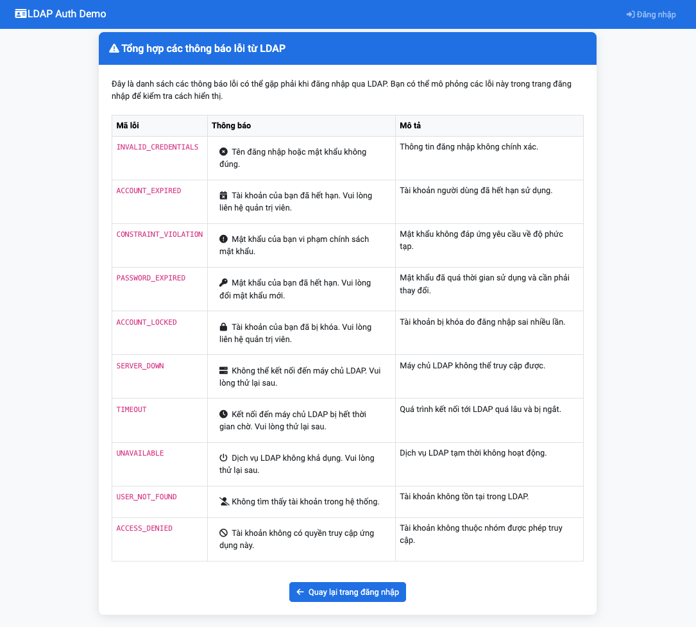

# LDAP Authentication Demo

Dự án demo đăng nhập LDAP sử dụng Django và ldap3, cho phép kiểm tra các trạng thái đăng nhập như:
- Sai tài khoản/mật khẩu
- Tài khoản hết hạn
- Lỗi hệ thống LDAP



## Yêu cầu hệ thống

- Python 3.x
- Django 5.2.1
- ldap3

## Cài đặt

1. Clone repository:
```bash
git clone <repository-url>
cd ldap_auth_demo
```

2. Tạo và kích hoạt môi trường ảo:
```bash
python -m venv venv
source venv/bin/activate  # Linux/Mac
# hoặc
.\venv\Scripts\activate  # Windows
```

3. Cài đặt các dependencies:
```bash
pip install django ldap3
```

4. Cấu hình LDAP:
Mở file `authapp/views.py` và cập nhật các thông tin LDAP:
```python
ldap_host = '<YOUR_LDAP_HOST>'
ldap_port = <YOUR_LDAP_PORT>
ldap_base_dn = '<YOUR_BASE_DN>'
ldap_bind_dn = '<YOUR_BIND_DN>'
ldap_bind_password = '<YOUR_BIND_PASSWORD>'
```

5. Chạy migrations:
```bash
python manage.py migrate
```

6. Khởi động server:
```bash
python manage.py runserver
```

7. Truy cập ứng dụng:
Mở trình duyệt và truy cập `http://127.0.0.1:8000/`

## Cấu trúc dự án

```
ldap_auth_demo/
├── ldapdemo/              # Project Django
│   ├── settings.py        # Cấu hình project
│   └── urls.py           # URL routing
├── authapp/              # App xử lý authentication
│   ├── views.py          # Logic xử lý LDAP
│   ├── forms.py          # Form đăng nhập
│   └── templates/        # Templates HTML
│       └── authapp/
│           └── login.html
├── manage.py
├── LDAP_Check.png        # Ảnh minh họa giao diện
└── README.md
```

## Tính năng

- Đăng nhập bằng LDAP
- Hiển thị thông tin người dùng sau khi đăng nhập:
  - Username
  - Họ và tên
  - Số nhân viên
  - Email
  - Số điện thoại
  - Chức danh
- Xử lý các trường hợp lỗi:
  - Sai tài khoản/mật khẩu
  - Tài khoản không tồn tại
  - Lỗi kết nối LDAP

## Push code lên Git

1. Khởi tạo Git repository (nếu chưa có):
```bash
git init
```

2. Tạo file .gitignore:
```bash
# Python
__pycache__/
*.py[cod]
*$py.class
*.so
.Python
env/
build/
develop-eggs/
dist/
downloads/
eggs/
.eggs/
lib/
lib64/
parts/
sdist/
var/
*.egg-info/
.installed.cfg
*.egg

# Django
*.log
local_settings.py
db.sqlite3
db.sqlite3-journal
media

# Virtual Environment
venv/
ENV/

# IDE
.idea/
.vscode/
*.swp
*.swo

# OS
.DS_Store
Thumbs.db
```

3. Thêm files vào Git:
```bash
git add .
```

4. Commit changes:
```bash
git commit -m "Initial commit: LDAP Authentication Demo"
```

5. Thêm remote repository (thay thế URL bằng repository của bạn):
```bash
git remote add origin <repository-url>
```

6. Push code:
```bash
git push -u origin main
```

## Bảo mật

- Không commit file chứa thông tin nhạy cảm (passwords, API keys)
- Sử dụng biến môi trường hoặc file cấu hình riêng cho các thông tin nhạy cảm
- Đảm bảo DEBUG=False trong môi trường production

## License

MIT License 
